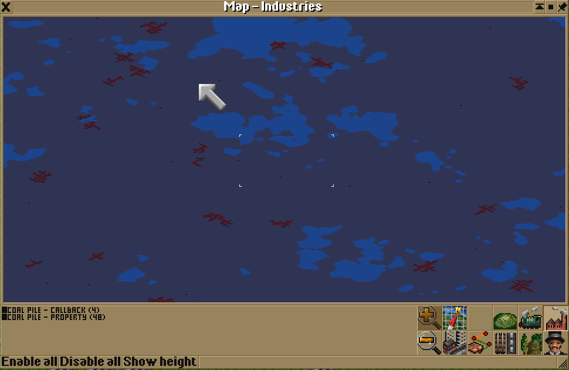

# Industry Probabilities

OpenTTD provides two ways of setting industry probability in NML: via property or via callback.

This test case of two otherwise-identical industries shows that the probability does not match between the two.